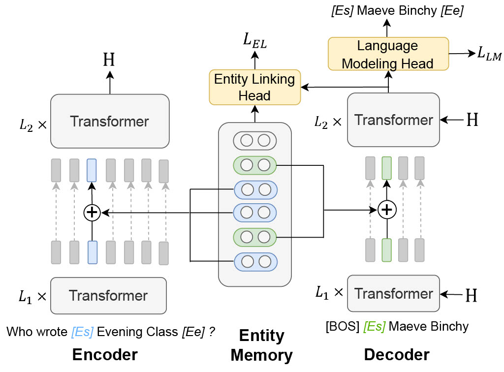

# EDMem

This is the repository for EDMem, a unified encoder-decoder framework with entity memory on entity-intensive tasks. It is a closed-book model augmented with entity knowledge which is pretrained on Wikipedia documents. It is also equipped with entity-aware decoding methods for entity generation. In open-domain QA and generation experiments, EDMem outperforms previous closed-book models like fine-tuned encoder-decoder models (e.g., BART) and memory-based auto-encoder models (e.g., EaE). For more details, please refer to our paper [*"A Unified Encoder-Decoder Framework with Entity Memory"*](https://arxiv.org/pdf/2210.03273.pdf) in EMNLP 2022.

<center></center>

This repository has the following contents:

- `data/`: the datasets used to fine-tune EDMem (updating...)
- `src/`: the source code of training the model (updating...)
- `run/`: instructions and scripts of running the model (updating...)
- `evaluation/`: evaluation scripts

### Environment

Via `pip`:
```bash
pip install torch==1.8.0+cu111 torchvision==0.9.0+cu111 torchaudio==0.8.0 -f https://download.pytorch.org/whl/torch_stable.html
pip install transformers==4.15.0 mpi4py==3.0.3 nltk==3.6.1 numpy==1.21.5 spacy==3.0.5 tqdm rouge
```

Via docker: Look for `zhihz0535/emag-torch1.8-transformers4.15:latest` on Docker Hub.

### Pretrained Model
Checkpoints can be found in this [Google Drive Link](https://drive.google.com/file/d/1ne5zXbs61e3SHEPauBLpLKx0bfMwwEA7/view?usp=sharing).

### Citation

If you find our work useful, please kindly cite our paper:
```
@inproceedings{EDMem,
  author    = {Zhihan Zhang and
               Wenhao Yu and
               Chenguang Zhu and
               Meng Jiang},
  title     = {A Unified Encoder-Decoder Framework with Entity Memory},
  booktitle = {Proceedings of the 2022 Conference on Empirical Methods in Natural
               Language Processing, {EMNLP} 2022, Abu Dhabi, United Arab Emirates,
               December 7-11, 2022},
  pages     = {689--705},
  publisher = {Association for Computational Linguistics},
  year      = {2022},
  url       = {https://aclanthology.org/2022.emnlp-main.43}
}
```
